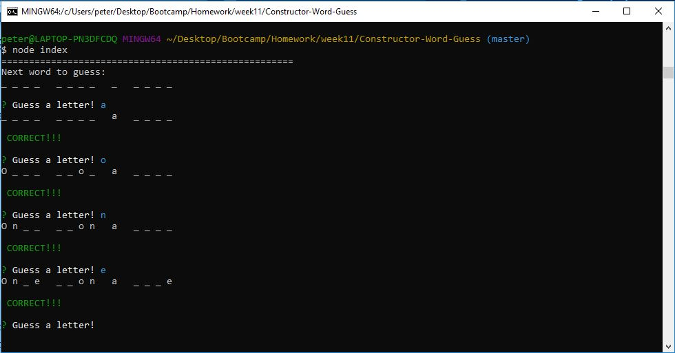
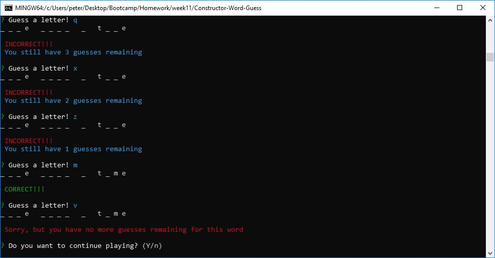
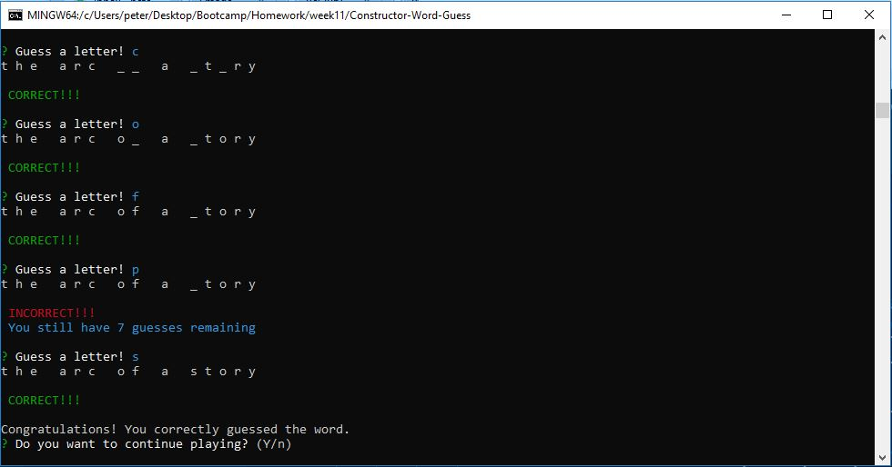

# Constructor-Word-Guess
Week 11 homework assignment

### Overview
This project uses Node.js to create a simple word guess game where players are presented with a word or phrase initially displayed in the console window as underscores. Players are prompted to guess letters one at a time and then are informed as to whether the letter exists in the word/phrase or not. After each correct guess, the guessed letters are displayed in their appropriate positions in the word/phrase. Players have up to 10 incorrect guesses to try and completely guess all the letters in the word/phrase. After they have either correctly guessed the word/phrase or exhausted their incorrect guesses count, they are given the opportunity to try the next word.

[Constructor word guess game demo video](https://github.com/phtag/Constructor-Word-Guess/tree/master/videos/Constructor-word-guess-demo.webm)

NOTE: This project is referenced on my portfolio page at [my portfolio](https://phtag.github.io/Updated-portfolio/)

### Purpose
The purpose of this assignment is to learn how to use JavaScript constructors in conjunction with Inquirer to implement a console-based  solution for this game. 

### Getting Started
To play the game, you will need to copy the package.json file for this project to your root node.js directory and install NPM packages for:
* Inquirer

After installing this packages, copy all of the files from the repository to your node.js root node. You will be running the game using the index.js file in node. 

Iniitially, a word or phrase with underscore characters appears underneath the statement "Next word to guess:". To guess a letter, type a character next to the "?Guess a letter!" prompt. For each guess, you will be informed as to whether the letter you guessed was one of the remaining unguessed characters or no. For each word or phrase, you will have up to 10 incorrect guesses in trying to guess all of the letters in the word or phrase. Continue making letter guesses until you have either:
* Correctly answered all of the letters
* Run out of guesses

When either of the above conditions occurs, you will be prompted as to whether or not you want to play again.

Here are some screenshots of what gets displayed on the console window:

This project is maintained by Peter Tag
